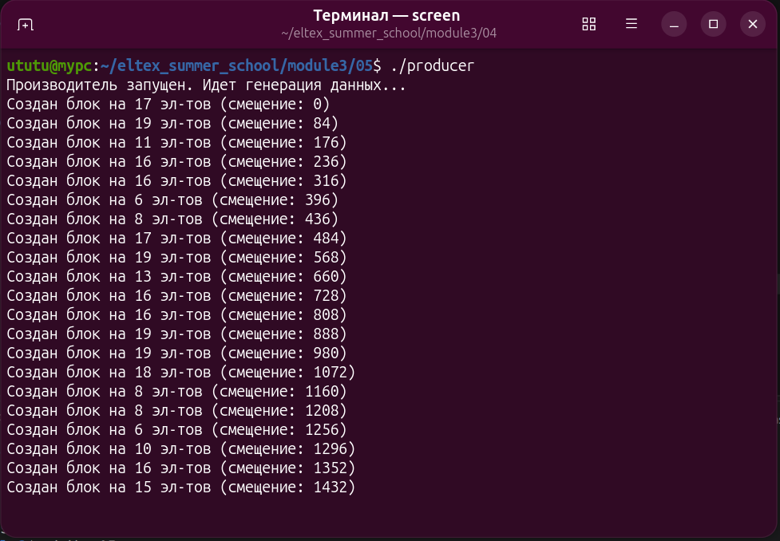
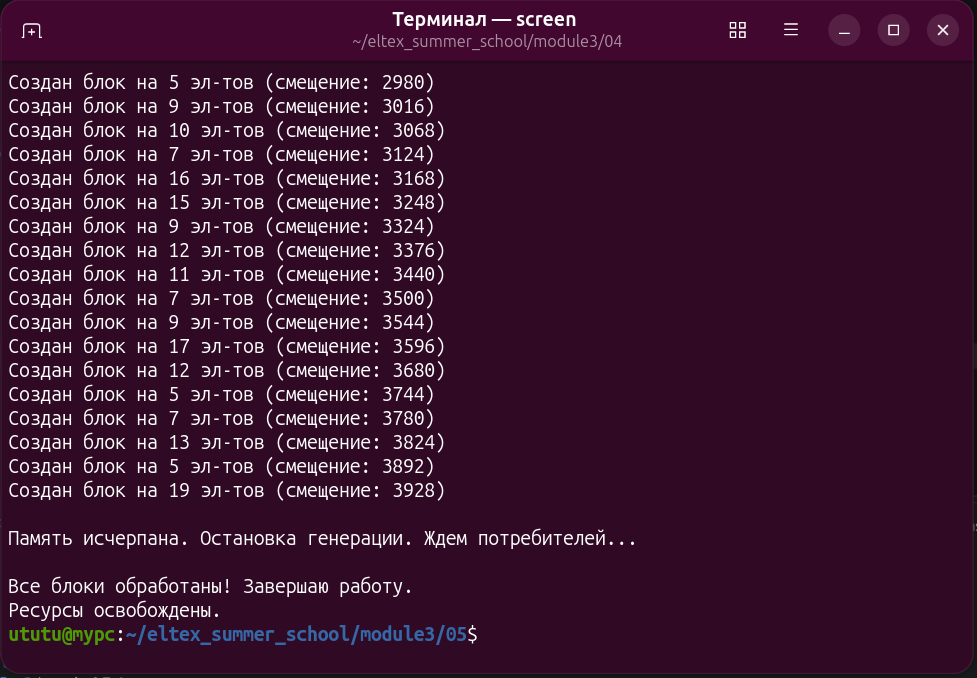
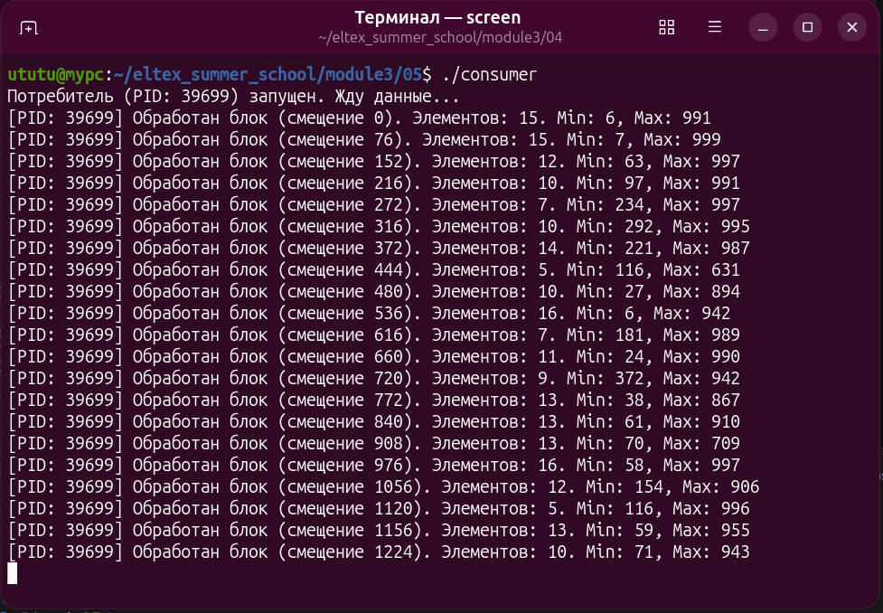
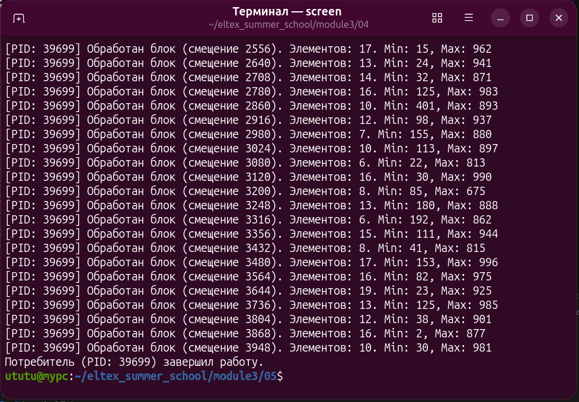

# Задание 5: Модель "Производитель-Потребители" (POSIX IPC)

## Описание задания

**Тема:** Семафоры + разделяемая память POSIX + некоторая имитация односвязного списка.
**Модель:** "Производитель-Потребители".

Процесс-производитель периодически генерирует массивы из случайного количества случайных чисел и записывает их в разделяемую память. Перед массивом указывается количество элементов в нем и адрес следующего блока данных. Если блок данных является последним, адрес следующего блока устанавливается равным 0. Генерация наборов чисел завершается, когда исчерпывается объем разделяемой памяти. Потребитель проверяет, что все наборы чисел обработаны, отключает разделяемую память и завершает работу. Если еще не все наборы обработаны, производитель "засыпает" на некоторое время, после чего снова проверяет, завершилась ли обработка.

Процесс-потребитель считывает данные из памяти и анализирует их: в каждом наборе находит максимальное и минимальное число и выводит эти значения на экран. Далее помечает набор как обработанный, указывая количество элементов в нем, равное 0. Чтение выполняется периодически. Проанализировав один необработанный набор чисел, потребитель "засыпает" на некоторое время.

Может быть запущено несколько экземпляров потребителей. Доступ к разделяемой памяти управляется семафором.

## Структура программы

Проект состоит из трех файлов:

1. **`common.h`** — общий заголовочный файл.
   - Содержит структуры данных для организации памяти (`struct ShmData` и `struct Block`).
   - Содержит константы именованных POSIX-объектов (`/posix_shm_task5` и `/posix_sem_task5`).
   - Имитация односвязного списка реализована через хранение смещений в байтах относительно начала буфера.

2. **`producer.c`** — процесс-производитель.
   - Создает разделяемую память через `shm_open` и задает ей размер через `ftruncate`.
   - Проецирует память в адресное пространство с помощью `mmap`.
   - Создает именованный POSIX-семафор с помощью `sem_open`.
   - Генерирует блоки случайных чисел, связывает их в список и после завершения очищает системные ресурсы (`shm_unlink`, `sem_unlink`).

3. **`consumer.c`** — процесс-потребитель.
   - Подключается к существующей памяти (`shm_open` + `mmap`) и семафору (`sem_open`).
   - Находит минимум и максимум, выводит их на экран и помечает блок как обработанный (`count = 0`).

## Сборка и запуск

```bash
make
```
Сначала в отдельном окне запускается производитель:

```bash
./producer
```
После один или более потребителей:
```bash
./consumer
```

## Пример работы
### Производитель:




### Потребитель:

 
