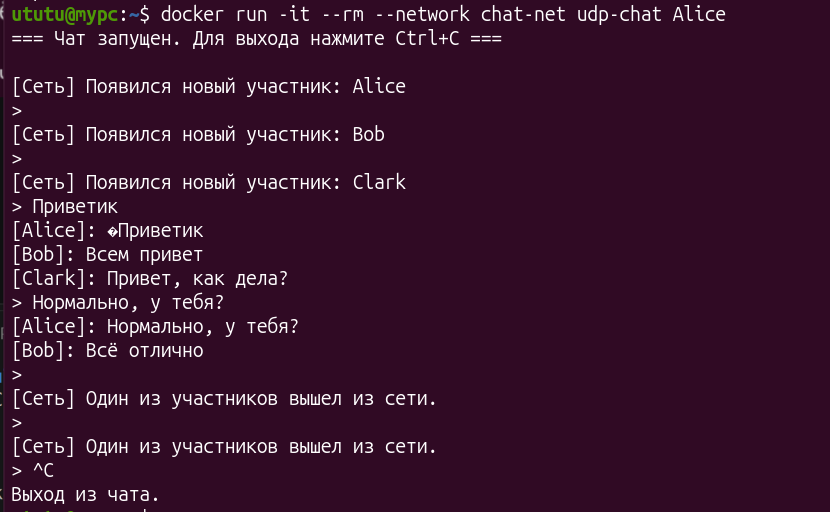
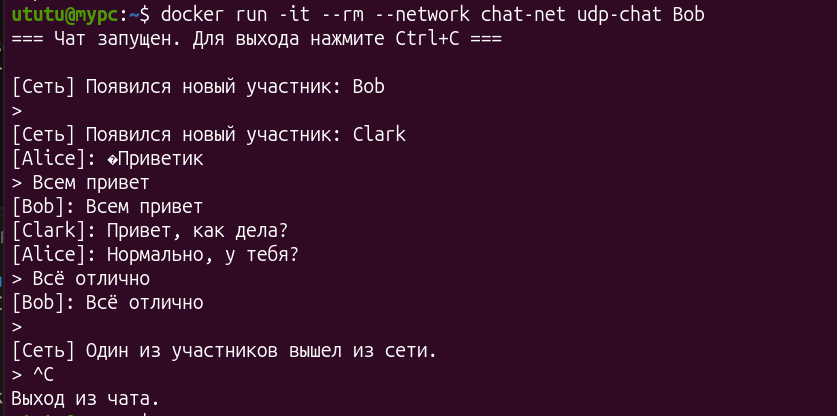
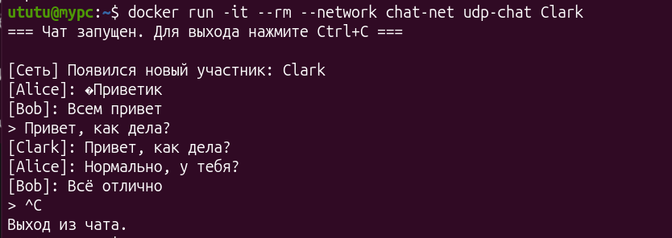

# Задание 6 (UDP сокеты)

Реализовать групповой чат с использованием широковещательной
рассылки через UDP-сокет. Клиенты равноправные (одно приложение).
При подключении (запуске программы) клиент рассылает
широковещательное сообщение. Другие подключенные клиенты отображают
сообщение, что в сети появился новый участник. Далее сообщения,
отправляемые клиентами, принимают остальные клиенты. При отключении
приложение отправляет сообщение, что оно не в сети.
Рекомендуется пересылать сообщения по физической сети, или
виртуальной сети между виртуальными машинами.

---

## Структура программы

Проект состоит из следующих файлов:
- **`main.c`** — точка входа в приложение, парсинг аргументов командной строки, инициализация сокета, настройка обработчика сигналов (`SIGINT` для выхода) и главный цикл обработки событий с использованием функции `poll()` (одновременное чтение ввода с клавиатуры и приём сетевых пакетов).
- **`chat.h`** — заголовочный файл с общими константами (порт, размер буфера) и прототипами функций. *(Если проект реализован в одном файле, этот пункт можно пропустить).*
- **`Dockerfile`** — файл конфигурации для сборки изолированного контейнера приложения в Docker.

---

## Сборка и тестирование через Docker

Для тестирования группового чата без необходимости открывать физическую сеть или настраивать виртуальные машины отлично подходит Docker. Он позволяет запустить несколько изолированных клиентов в единой виртуальной сети с поддержкой широковещательной (`broadcast`) рассылки.

### Пошаговая инструкция:

1. **Создайте изолированную сеть Docker** (если она еще не создана):
   ```bash
   docker network create chat-net

2. **Соберите Docker-образ из текущей директории**:
    ```bash
    docker build -t udp-chat .

3. **Запустите клиентов в разных терминалах.** Для каждого участника укажите его имя в качестве аргумента командной строки:
    * Терминал 1 (Клиент Алиса):
    ```bash
    docker run -it --rm --network chat-net udp-chat Alice
    ```

    * Терминал 2 (Клиент Боб):
    ```bash
    docker run -it --rm --network chat-net udp-chat Bob
    ```
    * Терминал 2 (Клиент Боб):
    ```bash
    docker run -it --rm --network chat-net udp-chat Clark
    ```

## Пример работы:

### Alice:


### Bob:


### Clark:


