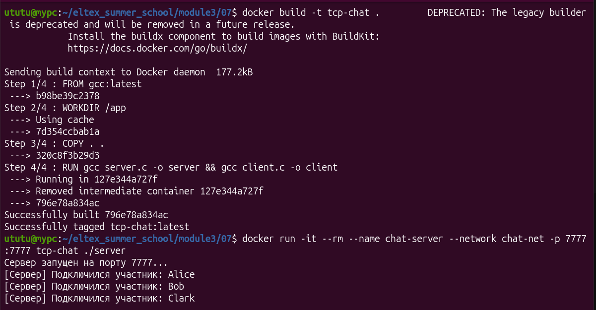
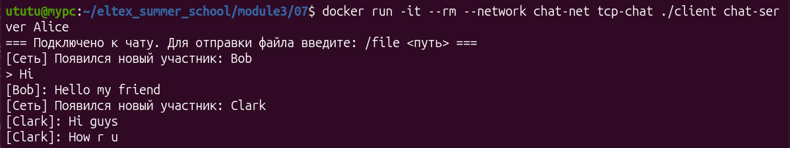
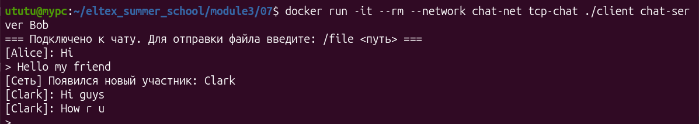
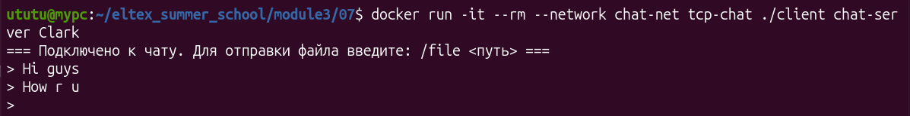

# Задание 7 (TCP сокеты и мультиплексирование)

Реализовать задание 6 с использованием TCP сокетов. Вместо
широковещательной рассылки использовать пересылку всем подключенным
клиентам через специальное приложение-сервер. Добавить возможность
отправки файлов для всех участников (сервер пересылает файл каждому
клиенту). Каждый клиент может как принимать, так и отправлять сообщения.
В клиенте для одновременного чтения сообщений и чтения данных с
клавиатуры использовать любой из механизмов мультиплексирования
(select/poll/epoll). В сервере использовать любой другой механизм
мультиплексирования для одновременной работы с множеством клиентов.

---

## Структура проекта

- **`server.c`** — TCP-сервер. Принимает подключения от клиентов, получает сообщения и файлы, а затем ретранслирует их всем остальным участникам. Для одновременной обработки множества клиентских сокетов используется механизм **`epoll`**.
- **`client.c`** — TCP-клиент. Подключается к серверу по IP-адресу или доменному имени. Для одновременного чтения ввода с клавиатуры (`stdin`) и входящих данных из сетевого сокета используется механизм **`poll`**.
- **`common.h`** — заголовочный файл с общими константами (порт, размер буфера) и структурами для протокола передачи (разделение на заголовки текстовых сообщений и файлов).
- **`Dockerfile`** — файл конфигурации для сборки изолированного контейнера с сервером и клиентом.

---

## Инструкция по сборке и запуску через Docker

### 1. Подготовка сети и сборка образа
Создайте виртуальную сеть (если она еще не создана):
```bash
docker network create chat-net
```

Соберите Docker-образ из текущей директории:
```bash
docker build -t tcp-chat .
```

### 2. Запуск сервера

Запустите сервер в отдельном терминале, задав имя контейнера chat-server.
(Если контейнер с таким именем уже существует, предварительно удалите его командой docker rm -f chat-server):
```bash
docker run -it --rm --name chat-server --network chat-net -p 7777:7777 tcp-chat ./server
```
### 3. Запуск клиентов

Откройте новые окна терминала для каждого клиента. Клиенты используют имя контейнера сервера (chat-server) для успешного подключения и резолва IP-адреса внутри Docker-сети.

Клиент 1 (Алиса):
```bash
docker run -it --rm --network chat-net tcp-chat ./client chat-server Alice
```
Клиент 2 (Боб):
```bash
docker run -it --rm --network chat-net tcp-chat ./client chat-server Bob
```

Клиент 2 (Клакр):
```bash
docker run -it --rm --network chat-net tcp-chat ./client chat-server Clark
```

## Пример работы:

### Запуск сервера:



### Клиент Алиса:



### Клиент Боб:



### Клиент Кларк:

